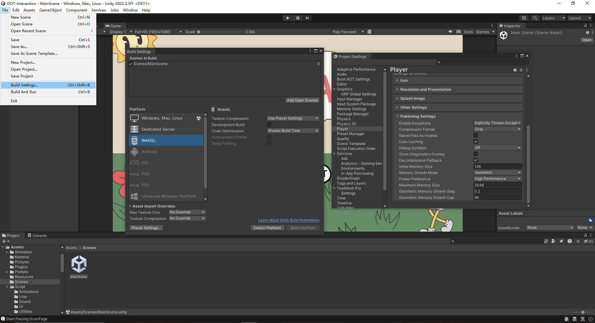
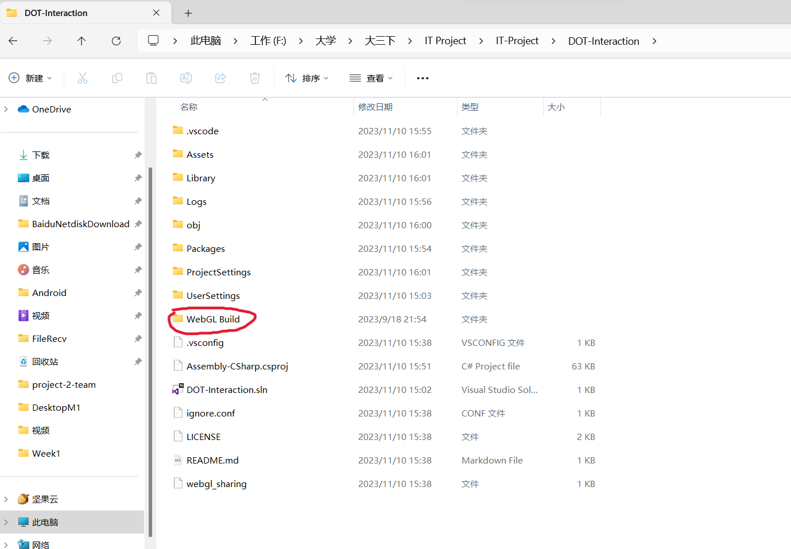

# Game Overview: Vis-CAT

## Core Concept:

This game use to test children's visual cognition and space imagination ability. Children need to copy the actual or some changing line pattern to show their abilities.

## Genre:

The App should be a simple line connection application, which included the test stage and the stage that play need to play the game to test their ability. This game do not want to give children any pression and hope to let children feel enjoy when they doing the test.

## Target Audience:

The students between 5 - 12 years old, and needs teacher to play with them.

## Progress

### Control:

The game is facing to Tablet users, so basically using the touch-screen pattern, but also designed to able to run in computer by using mouse.

### Pages:

Check https://404error12138.atlassian.net/wiki/spaces/4EP/pages/3375119/UI+Design

### Gameplay Mechanics:

This will be a 2D flat plane game just like a normal browser, which run like Kahoot. This app will fulfill the following functions:

- Player is able to interact with the buttons and buttons are able to do their works
- Player is able to play freely in Try Stage.
- Player is able to experience the normal gaming process in Play Stage
- Player has only one retry chance in each level
- Player will directly finish the game after they fulfill the condition
- Player are able to do the interaction with vis-cat
- The APP is able to scan the QR Code and receive the data in QR Code
- The APP is able to send the final result of player to the backend

## Game Design

### Art and Audio:

#### Art Style:

Responsible by Raad and Marco

The art style should be fully cartoon, and create a atmosphere with please and funny. The element in background should be simple to avoid distract children's attention. The game will include some easy animations, such as the cat is able to wave it's arm, the sun is able to rotate, and the cloud can move around, etc.

#### Sound & Music:

Responsible by Tom

As customer's requirement, the game do not have background music, but still has the sound effect when play connecting lines.

#### Assets:

To mask the game as simple as possible, we will make the background of game to pure color with different level, and add more elements gradually. We found dialog box, cloud, sun, cat, music score, stars, etc. Some simple icons, use for setting and page changes. All assets and fonts are found in the free website, and input them in Unity for further creation.

The animation will entirely made in Unity, which using Unity's Animator and Animation Controller Components.

#### User Interface (UI):

The UI was quite brief, the button is round side with white background, and the dot matrixes are using the default material in Unity.

**References:** 

UI:

https://www.figma.com/community/file/1217183388213575331/retro-cartoon-animation

https://www.figma.com/community/file/1019353050314527791/doodle-icons

https://www.figma.com/community/file/1074773789352934150/comics-in-figma

Fonts:

https://fonts.google.com/specimen/Gamja+Flower?query=gamja+flower

AI Voice:

https://ondoku3.com/en/

### Technology and Tools:

Development Software：Unity

UI Design Software：Figma

Animation Design: Adobe Effect

AI Voice Creator: https://ondoku3.com/en/

Sound: StudioOne5

### Team Communication, Timelines and Task Assignment:

Scrum Master: Clain Chen

Project Owner: Steve Chen

Programmer & Animation Creator: Clain Chen

API Implementation: Steve Chen

UI Design In Figma & Animation Design: Raad, Marco Yue

UX Design: Tom Fang

## How to use

This is a Unity project. You need to open the DOT-Interaction file inside the main repository with Unity editor version 2022.3.5f1(LTS) if want to make any changes to this program. We provide a WebGL build inside the (...) file. However, if you want to build the project again, select file->Build settings, and make sure you switch to the WebGL platform before build. The player settings are already set for you.

The WebGL build file is what you want to put in your cloud server.

